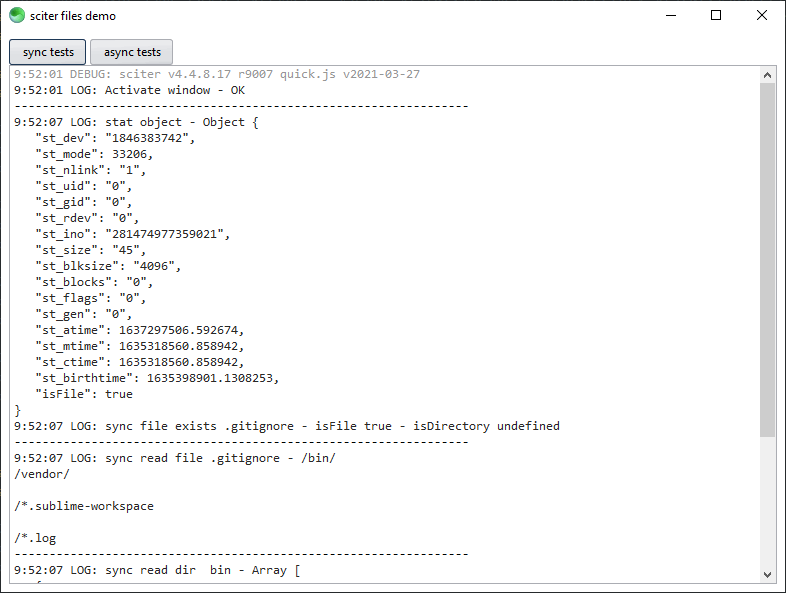

# sciter files

This is a [sciter.js](https://sciter.com/) project that experiments with the filesystem.

It explores all file system functions, namely: async/sync create, read, write and delete both files and directories.

## demo

- git clone the repository
- install packages `npm install`
- install latest sciter sdk `npm run install-sdk`
- start the demo `npm run scapp`

## demo requirements

- A recent version of Node.js `node` (tested with 22 LTS) and its package manager `npm`.
    - On Windows [download](https://nodejs.dev/download/) and run the installer
    - On Linux check the [installation guide](https://www.digitalocean.com/community/tutorials/how-to-install-node-js-on-ubuntu-20-04#option-2-%E2%80%94-installing-node-js-with-apt-using-a-nodesource-ppa)

## important considerations

- `__DIR__` is always an URL
- All `sys.fs` functions expect a path and not an url. Use `URL.toPath(__DIR__ + "file")` to convert
- `sys.fs` is a thin wrapper of libuv::* that is a wrapper of posix::*
- Andrew does recommend to use absolute path instead of relative. The problem with current working directory is common to all apps that use that API. [See Why is using a relative path generally bad?](https://gist.github.com/DaveRandom/6830e379578a66e2c82593137e79d099#why-is-using-a-relative-path-generally-bad)

## SDK reference

    https://github.com/c-smile/sciter-js-sdk/blob/main/docs/md/module-sys.md
